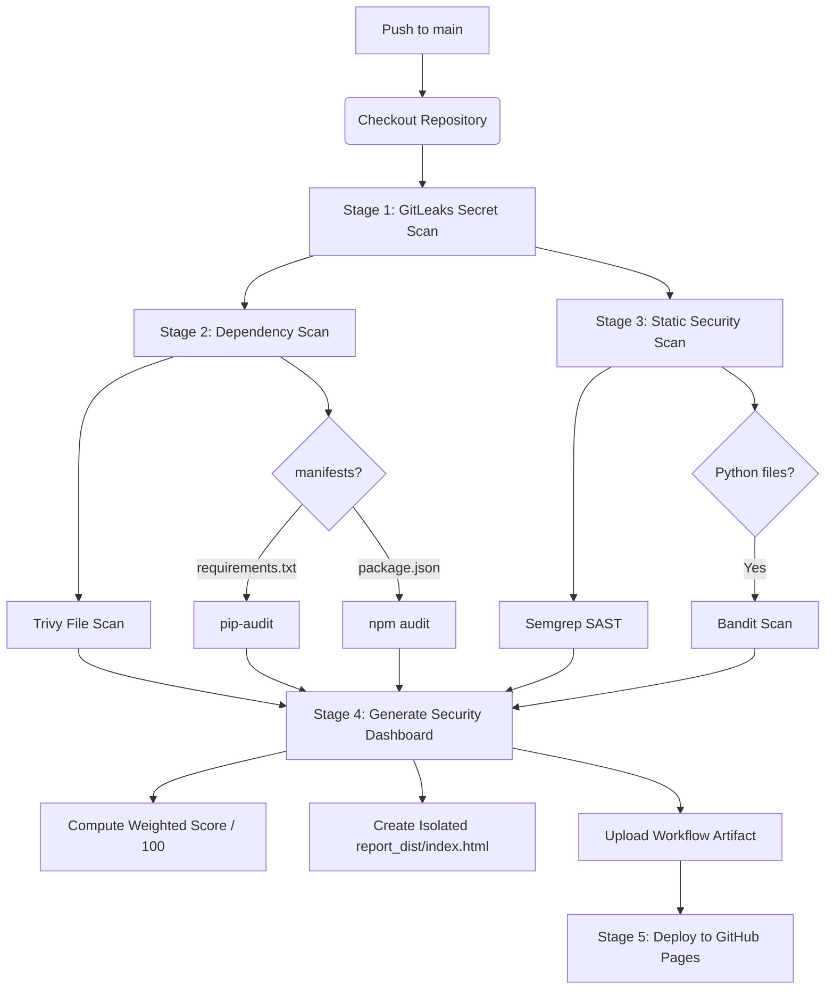
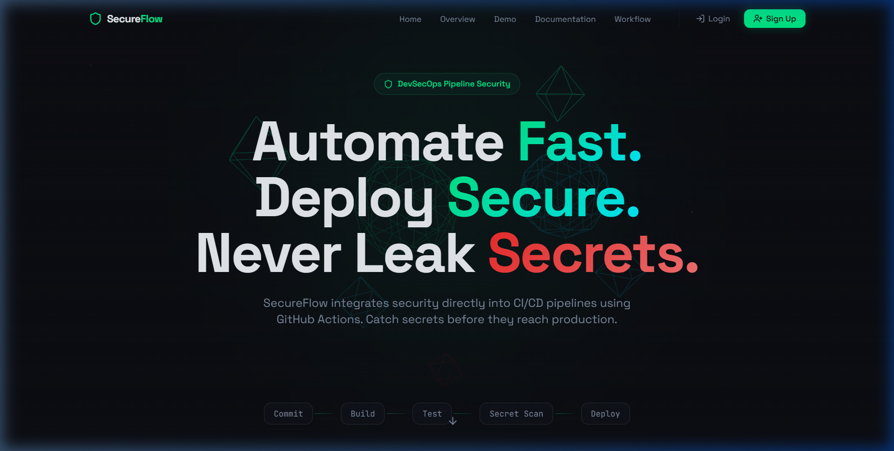
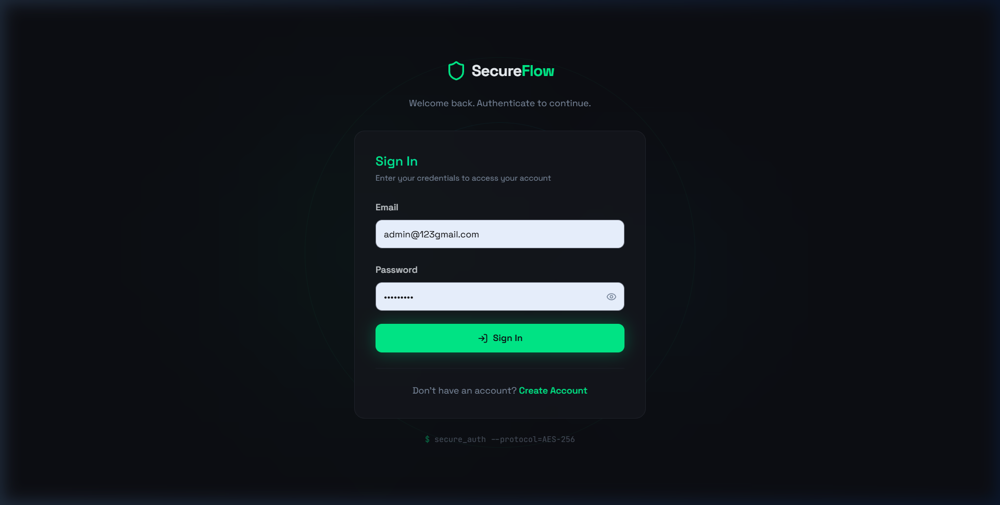
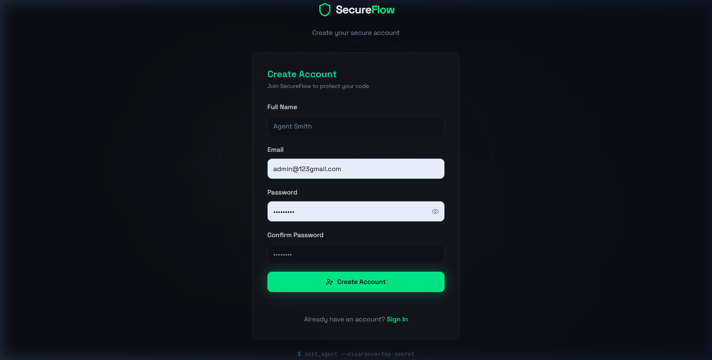
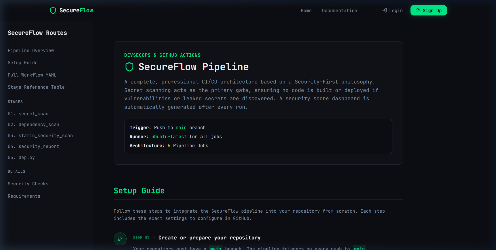

# 🔐 SecureFlow — Complete DevSecOps CI/CD Pipeline Dashboard

[](LICENSE)
[](https://github.com/username/repo/actions)
[](https://react.dev)
[](https://www.typescriptlang.org)
[](https://vitejs.dev)
[](https://tailwindcss.com)

**SecureFlow** is an enterprise-grade DevSecOps CI/CD dashboard application. It provides developers and security teams with an interactive portal that mirrors live pipeline configurations, acts as a documentation repository for GitHub Actions setup, and provides secure authentication endpoints. Built with a **Security-First philosophy**, SecureFlow features multi-layer vulnerability scanning, custom static analyses, and isolated report generation.

---

## 🌐 Live Demo

🔗 **Website:** https://flowshield.onrender.com

Experience the live SecureFlow platform with responsive desktop and mobile support.

## 🧪 Demo Account

Want to explore SecureFlow without creating a new account? Use the demo credentials below.

| Role | Email | Password |
|------|--------|----------|
| Administrator | `admin234@gmail.com` | `Admin$4545` |

> ⚠️ This demo account is provided for evaluation and testing purposes only.

---

## 📐 Pipeline Architecture Workflow



### Pipeline Jobs Execution Flow

1. **`secret_scan` (Universal)**:
   * **Purpose**: Checks for exposed keys, credentials, and configuration secrets in commits.
   * **Scanner**: `GitLeaks v2` Action.
   * **Rule**: Halts pipeline immediately on failure to prevent security leaks.

2. **`dependency_scan` (Universal + Conditional Python/Node.js)**:
   * **Universal scan**: Runs Aquasecurity `Trivy` filesystem audit across all files to find OS/library level CVEs.
   * **Python audit**: Checks for the existence of `requirements.txt`. If present, installs and executes `pip-audit`.
   * **Node.js audit**: Checks for the existence of `package.json`. If present, installs and executes `npm audit --audit-level=high`.

3. **`static_security_scan` (Universal + Conditional Python)**:
   * **Universal scan**: Runs a `Semgrep` static analysis scan configured to `auto` rulesets.
   * **Python SAST**: Scans directory for any `.py` source files. If present, runs `Bandit` recursively on directories.

4. **`security_report` (Always Runs)**:
   * **Condition**: Executed via `if: always()` to ensure dashboard reports are published even if checks fail.
   * **Logic**: Gathers the outcomes of `secret_scan`, `dependency_scan`, and `static_security_scan`. Calculates a score out of 100 (Secrets: 30%, Dependencies: 40%, SAST: 30%).
   * **Isolation**: Creates an isolated `report_dist` directory to build the standalone HTML security summary. *Only* the report folder is uploaded to Pages to prevent source leakage.

5. **`deploy` (GitHub Pages Deployment)**:
   * **Permission requirements**: `pages: write`, `id-token: write`, and `contents: read`.
   * **Target**: Deploys the isolated `report_dist` directly to the live GitHub Pages site.


---

## 🚀 Step-by-Step GitHub Actions Workflow Setup & Deployment Guide

To deploy this security pipeline in your GitHub repository and host the dashboard successfully on GitHub Pages, follow these detailed steps:

### 1️⃣ Step 1: Create the Workflow File
In your repository root directory, create the folder structure `.github/workflows/` and add a file named `secureflow.yml`:
```bash
mkdir -p .github/workflows
touch .github/workflows/secureflow.yml
```
Copy and paste the full YAML code provided in the **Documentation** section of this application (or copy it from the **Full Workflow YAML** section) into this file.

### 2️⃣ Step 2: Configure GitHub Pages Publishing Source
GitHub Pages must be configured to build from **GitHub Actions** rather than a specific branch:
1. Navigate to your repository page on **GitHub.com**.
2. Click on the **Settings** tab at the top.
3. In the left sidebar, click on **Pages** (under the "Code and automation" section).
4. Under **Build and deployment → Source**, change the dropdown selection from *Deploy from a branch* to **GitHub Actions**.

### 3️⃣ Step 3: Grant Workflow Write Permissions
GitHub Actions needs permission write privileges to upload build artifacts and coordinate token handshakes for GitHub Pages:
1. In the repository **Settings** tab, click on **Actions → General** in the left sidebar.
2. Scroll down to the **Workflow permissions** section at the bottom.
3. Toggle the option to **Read and write permissions**.
4. Check the box that says **Allow GitHub Actions to create and approve pull requests** (optional but recommended).
5. Click the **Save** button.

### 4️⃣ Step 4: Commit and Push to Trigger Pipeline
Commit the new workflow file and push it to the `main` branch to trigger your first security scan:
```bash
git add .github/workflows/secureflow.yml
git commit -m "ci: integrate SecureFlow DevSecOps pipeline"
git push origin main
```
Navigate to the **Actions** tab of your GitHub repository to watch each stage run in sequence.

### 5️⃣ Step 5: Access the Dashboard and Artifacts
* **Live Dashboard URL**: Once the final `deploy` job finishes successfully, go back to **Settings → Pages**. Your live dashboard URL will be displayed at the top (e.g., `https://<your-username>.github.io/<your-repo-name>/`).
* **Download Raw Report**: Under the completed Actions run summary page, scroll down to the **Artifacts** section at the bottom to download the raw `security-report.zip` containing `security_report.html` for local offline usage.

---

## 📂 Project Directory Structure

```
SecureFlow/
├── .github/
│   └── workflows/
│       └── secureflow.yml      # CI/CD DevSecOps Action Pipeline
├── public/                     # Public assets
│   ├── placeholder.svg
│   └── screenshots/            # App previews & tour captures
│       ├── landing.png
│       ├── login.png
│       ├── signup.png
│       └── documentation.png
├── server/                     # Express.js Backend Server
│   ├── models/
│   │   └── User.js             # Mongoose Database Model (bcrypt + verification)
│   ├── routes/
│   │   └── auth.js             # Authentication endpoints (signup, login, profile/me)
│   └── index.js                # Server Entry Point (CORS, Express, DB Config)
├── src/                        # React Frontend Application
│   ├── components/
│   │   ├── layout/             # Shared layout layouts (Navbar, Footer)
│   │   ├── sections/           # Landing page interactive panels (Hero, Overview, Workflow)
│   │   ├── three/              # Three.js 3D Graphic Models (PipelineScene)
│   │   ├── ui/                 # Reusable Shadcn UI Blocks
│   │   ├── AnimatedSection.tsx
│   │   └── NavLink.tsx
│   ├── contexts/
│   │   └── AuthContext.tsx     # Global JWT & Auth State Provider
│   ├── hooks/
│   │   ├── use-toast.ts
│   │   ├── use-mobile.tsx
│   │   └── useAuth.ts          # Custom Wrapper Hook for State Access
│   ├── lib/
│   │   └── utils.ts            # Utility functions (clsx, tailwind-merge)
│   ├── pages/
│   │   ├── Index.tsx           # Home Landing Page Dashboard
│   │   ├── Documentation.tsx   # Workflow Details & Integration Guide
│   │   ├── Login.tsx           # Auth Credentials Login
│   │   ├── Signup.tsx          # Auth Register Onboarding
│   │   └── NotFound.tsx        # 404 Routing Page
│   ├── App.css
│   ├── index.css               # Main CSS Style Variables
│   ├── main.tsx                # App Entry Mount
│   └── vite-env.d.ts           # Vite Type Definitions
├── eslint.config.js            # Code syntax validator
├── postcss.config.js           # Styles compiler
├── tailwind.config.ts          # Tailwind Theme Configurations
├── tsconfig.json               # TypeScript Rules Config
├── vite.config.ts              # Vite configurations & proxies
└── package.json                # Project manifests & scripts
```

---

## 🎨 User Interface Preview

Experience the premium dark-mode interface, glassmorphism panel styles, and responsive layout designs of SecureFlow.

| Page Interface | Visual Screenshot Preview |
| :--- | :--- |
| **✨ Home Landing Page** <br><br> Includes interactive sections, three.js canvas animations, technology stack lists, and brief tutorials of the scanner logic. |  |
| **🔐 Credentials Login** <br><br> Fully responsive credentials access panel that authenticates against server credentials and stores session state. |  |
| **🚀 Account Creation** <br><br> Custom sign-up panel validating matching passwords and minimum security length requirements. |  |
| **📖 Complete Documentation** <br><br> Sidebar-controlled navigation indexing the pipeline jobs, setup steps, full YAML downloads, and requirements. |  |

---

### 📱 Mobile Responsive View

SecureFlow is fully responsive and optimized for mobile devices.

| 🏠 Mobile Landing Page | 🚀 Mobile Registration | 🔐 Mobile Login |
|:---:|:---:|:---:|
|  |  |  |

---

## 🚀 Getting Started Locally

### 🔧 Installation

1. **Clone the Repository**:
   ```bash
   git clone https://github.com/username/repo-name.git
   cd repo-name/SecureFlow
   ```

2. **Install Workspace Dependencies**:
   ```bash
   npm install
   ```

3. **Configure Environment Variables (`.env`)**:
   Create a `.env` file at the root:
   ```env
   PORT=5000
   MONGO_URI=mongodb://localhost:27017/secureflow # Leave empty to use in-memory DB fallback
   JWT_SECRET=your-custom-jwt-secret-key-string
   ```

4. **Launch Development Environments**:
   Start the backend and frontend servers simultaneously using separate terminals:
   * **Backend Express Server**:
     ```bash
     npm run server
     ```
   * **Frontend Dev Server**:
     ```bash
     npm run dev
     ```

   * **Urls**:
     * Client UI: [http://localhost:8080](http://localhost:8080)
     * Server API: [http://localhost:5000](http://localhost:5000)

---

## 🛠️ Project Script Manifests

The following scripts are available in the project package configuration:

| Command | Action | Description |
| :--- | :--- | :--- |
| `npm run dev` | Runs the Vite client | Launches frontend Dev Server at port `8080` with fast hot module replacement (HMR). |
| `npm run server` | Launches server | Starts the Node.js Express server on port `5000` connecting to Database. |
| `npm run build` | Compiles app | Generates optimized production client files in the `dist` folder. |
| `npm run lint` | Syntax validation | Executes ESLint validation check across components and configs. |
| `npm run test` | Unit testing | Executes unit testing suite using Vitest. |

---

## 🛡️ Security Best Practices Enforced

* **Isolated Pages Build**: The GitHub Actions workflow output strictly isolates the `report_dist` directory before uploading to GitHub Pages, ensuring no source files or configuration manifests are leaked.
* **Credentials Hashing**: Hashed with a salt factor of 12 using `bcryptjs` before insertion into the database to guarantee security against dictionary attacks.
* **Route Protection & JWT Validation**: Profile endpoints request Bearer tokens validated against cryptographic signature keys using JWT logic.
* **Safe JSON Output Parsing**: Schema specifications remove password hashes on string transformation (`toJSON`) to prevent accidental leaks.
